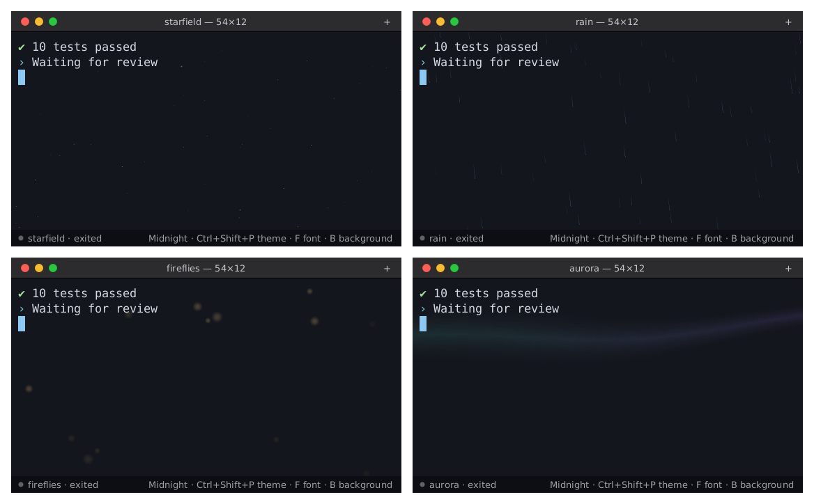

# agentty

**A lightweight terminal built for running and supervising AI coding agents.** Looks like macOS Terminal, runs on Linux, macOS and Windows, and uses about 16 MB of memory.

[](https://github.com/premanand8800/agentty/actions/workflows/ci.yml)
[](https://github.com/premanand8800/agentty/releases/latest)
[](LICENSE)


When you run Claude Code, Codex or Antigravity for hours, often several at once, a normal terminal doesn't tell you which agent is waiting for you, eats memory on huge output, and can't be driven by other programs. agentty does all three.

## What makes it an agent terminal

- **Knows which agent needs you.** Every tab has a status dot: 🟢 working, 🟠 **needs you**, ⚪ idle, 🔴 exited with an error. "Needs you" fires on the terminal bell, or when output stops and the screen shows a waiting prompt ("Do you want to…", "(y/n)", "❯ 1. Yes", …). Background tabs send a desktop notification.
- **Dock badge.** The app icon shows how many tabs are open and highlights when an agent needs you (Ubuntu Dock, Dash to Dock, KDE).
- **Agent control API.** Other agents and scripts can open tabs, type into them, read the screen as plain text and wait until an agent is done or needs input. Every tab gets `AGENTTY_SOCKET` and `AGENTTY_TAB_ID`, so an agent inside agentty can supervise its siblings.
- **One key per agent.** `Ctrl+Shift+1..9` opens your shell, Claude, Codex, Antigravity, Gemini, Aider or Goose, whichever are installed.
- **Built for long sessions.** Scrollback is capped per tab, nothing is retained beyond it, and it uses 0% CPU while agents are idle.
- **Draws agent UIs correctly.** Box drawing (`╭─╮ │ ╰─╯`, tables, blocks) is drawn as shapes, not font glyphs, so panels join seamlessly. Truecolor, 256 colors, bold, italic, wide CJK characters.

## Measured (Linux, Wayland, 1 window)

| | Memory |
|---|---|
| 1 tab, idle | **16 MB** |
| 1 tab after 300,000 lines of output | 28 MB |
| 4 tabs with full scrollback | 65 MB |
| CPU while agents are idle | **0.0%** |
| CPU with a background animation on (20 fps) | 1.2–3.5% |
| Binary | 5.5 MB, no runtime dependencies (2.3 MB download) |

It stays this small because it renders on the CPU (no GPU context, which alone costs 50–150 MB) and only when something changes. Fonts are parsed lazily: a large CJK fallback font isn't loaded until CJK text appears.

## Themes

The nine macOS Terminal profiles plus *Midnight*. Cycle with `Ctrl+Shift+P`, or set `theme` in the config.


## Fonts and backgrounds

- **Font:** `Ctrl+Shift+F` cycles through the monospace fonts installed on your machine (`agentty fonts` lists them). `Ctrl+Shift+=` / `-` / `0` changes the size.
- **Relaxing backgrounds:** `Ctrl+Shift+B` cycles through *starfield*, *rain*, *snow*, *fireflies*, *aurora* and *off*. They are drawn only on empty background, never over text, pause when the window is hidden and slow down when it isn't focused. Off by default.

Your choices are saved to `~/.config/agentty/ui.toml` and restored next time. Your `config.toml` is never rewritten.



## Install

**Linux and macOS:**

```bash
curl -fsSL https://raw.githubusercontent.com/premanand8800/agentty/main/scripts/get.sh | sh
```

On Linux this installs `~/.local/bin/agentty` and an app-menu entry. On macOS it installs `~/Applications/agentty.app` (Launchpad, Spotlight) and the `agentty` command.

**Windows:** download `agentty-windows-x86_64.zip` from the [latest release](https://github.com/premanand8800/agentty/releases/latest), unzip it, and run `agentty.exe`. Windows SmartScreen may warn because the app isn't signed yet: choose **More info → Run anyway**.

**Manual downloads** (with SHA256 checksums) are on the [releases page](https://github.com/premanand8800/agentty/releases/latest): Linux x86_64 and ARM64, macOS universal (Apple Silicon and Intel), Windows x86_64.

**From source** (Rust 1.89+):

```bash
git clone https://github.com/premanand8800/agentty && cd agentty
./scripts/install.sh        # Linux: builds, installs, adds an app-menu entry
cargo build --release       # any OS: target/release/agentty
```

### Platform support

| | Linux | macOS | Windows |
|---|---|---|---|
| Terminal, tabs, themes, agent status | ✅ | ✅ | ✅ |
| Look | macOS-style title bar drawn by agentty | native title bar and traffic lights | macOS-style title bar drawn by agentty |
| Shortcuts | `Ctrl+Shift+…` | `⌘…` | `Ctrl+Shift+…` |
| Desktop notifications | ✅ `notify-send` | ✅ | not yet |
| Dock badge (tab count, urgent) | ✅ | not yet | not yet |
| Agent control API (`agentty ctl`) | ✅ | ✅ | not yet |
| Memory shown in status bar | ✅ | – | – |

Linux is where agentty is developed and tested day to day. The macOS and Windows builds compile and lint cleanly in CI, but have had less real-world use, so please [report issues](https://github.com/premanand8800/agentty/issues).

## Shortcuts

| Keys | Action |
|---|---|
| `Ctrl+Shift+T` | New tab (first profile, usually your shell) |
| `Ctrl+Shift+1` … `9` | Open profile 1–9 (`agentty profiles` lists them) |
| `Ctrl+Shift+W` | Close tab |
| `Ctrl+Tab`, `Ctrl+PageUp/PageDown`, `Alt+1..9` | Switch tabs |
| `Ctrl+Shift+C` / `Ctrl+Shift+V` | Copy / paste (bracketed paste when the program asks) |
| `Ctrl+Shift+P` | Next theme |
| `Ctrl+Shift+F` | Next font |
| `Ctrl+Shift+B` | Next background animation (or off) |
| `Ctrl+Shift+=` / `-` / `0` | Bigger / smaller / reset font size |
| `Shift+PageUp/PageDown/Home/End` | Scrollback |
| Mouse | Drag to select, wheel to scroll, middle-click to paste, middle-click a tab to close it |

On macOS use `⌘` instead of `Ctrl+Shift` (`⌘T`, `⌘W`, `⌘C`, `⌘V`, `⌘P`, `⌘F`, `⌘B`, `⌘1`…).

## Agent control API

Each window listens on its own Unix socket, `$XDG_RUNTIME_DIR/agentty/ctl-<pid>.sock`, and `ctl.sock` points at the most recently opened window. Inside a tab, `AGENTTY_SOCKET` names that tab's own window, so `agentty ctl` always controls the window it runs in. Only your user can open the sockets (mode `0600` in a `0700` directory). Nothing listens on the network.

```bash
agentty ctl list
agentty ctl open Claude                              # or: agentty ctl open -- bash -lc 'make test'
agentty ctl send 2 "fix the failing test in pricing.py"
agentty ctl wait 2 --until settled --timeout 600      # returns when it's done or needs you
agentty ctl read 2 --lines 80                         # plain text, no escape codes
agentty ctl send 2 y                                  # answer its question
```

The protocol is one JSON object per line, so any language can use it:

```json
{"op":"open","command":["codex"],"cwd":"/home/me/repo"}   →  {"ok":true,"id":3}
{"op":"send","id":3,"text":"add tests","enter":true}
{"op":"wait","id":3,"until":"attention","timeout_ms":600000}
{"op":"read","id":3,"lines":200}                          →  {"ok":true,"text":"…","tab":{…}}
```

`until` can be `idle`, `attention` (waiting for input), `exit`, or `settled` (any of these). Other ops: `status`, `focus`, `close`, `theme`, `background`.

## Configuration

`~/.config/agentty/config.toml` (Windows: `%APPDATA%\agentty\config.toml`). Every key is optional; unknown keys are an error.

```toml
theme = "Pro"
font_size = 13.5
# font = "JetBrains Mono"      # a family from `agentty fonts`, or a path to a .ttf/.otf
background = "off"             # starfield, rain, snow, fireflies, aurora
background_intensity = 0.6     # 0.0 to 1.0
background_fps = 20            # 5 to 60
scrollback = 5000              # lines per tab
notifications = true
startup_profile = "Shell"
# attention_phrases = ["do you want to", "(y/n)", ...]

[[profiles]]
name = "Claude"
command = ["claude"]

[[profiles]]
name = "Codex (repo)"
command = ["codex"]
cwd = "/home/me/repo"
```

Without `[[profiles]]`, agentty uses your shell plus every agent CLI it finds on `PATH`.

Theme, font, font size and background changed with shortcuts are saved in `ui.toml` next to `config.toml`, and override it. Delete `ui.toml` to go back to your config.

## Design

- **Product:** the user supervises several long-running agents. The most valuable signal is "which one is waiting for me". That's the status dot, the notification and the `attention` wait, all driven by the same detector.
- **Engineering:** the terminal core is [`alacritty_terminal`](https://crates.io/crates/alacritty_terminal), the battle-tested core of Alacritty (VT parsing, grid, PTY). agentty adds the window, the CPU renderer (`softbuffer` + `ab_glyph`), tabs, agent status and the control API. About 4,000 lines of Rust, tests included.
- **Systems:** one I/O thread per tab and one UI thread. Control requests run on their own threads and reach the UI through the event loop, so a slow client never blocks drawing. The window sleeps until there is input, output or a status change.

## Limitations

- No GPU rendering. Fine for terminals, but full-screen redraws on 4K monitors cost more CPU than a GPU terminal.
- No split panes yet (tabs only), no ligatures, no IME input, no image protocols (sixel/kitty).
- Mouse clicks and drags aren't reported to programs yet. The wheel is: programs that ask for mouse events get wheel reports, other full-screen apps get arrow keys, and the shell scrolls back.
- "Needs you" detection is a heuristic. The bell is reliable; prompt phrases can be tuned with `attention_phrases`.
- On Linux and Windows the window draws its own macOS-style title bar. Window-manager snapping depends on your desktop.
- The macOS app is ad-hoc signed but not notarized, and the Windows exe isn't signed yet.

## License

MIT
