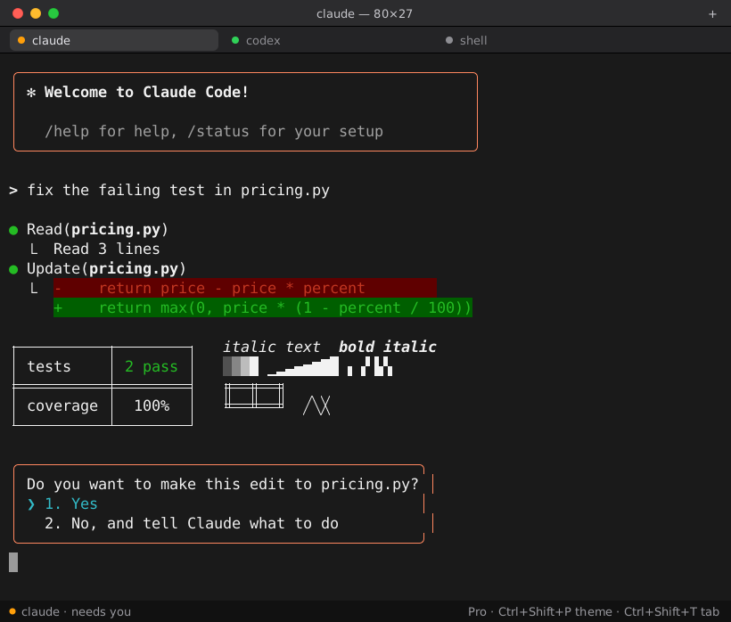
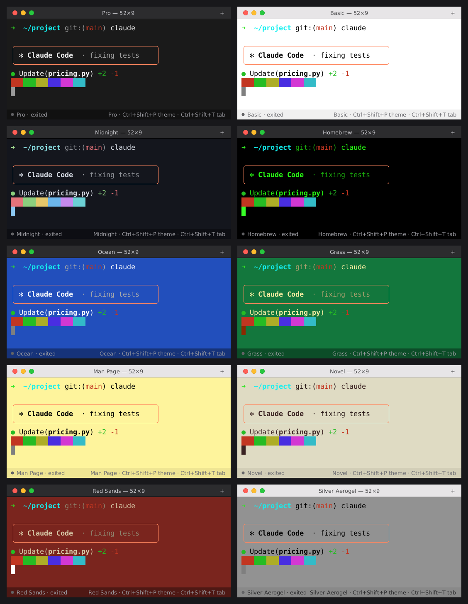

# agentty

**A lightweight terminal built for running and supervising AI coding agents.** Looks like macOS Terminal, runs on Linux, uses about 16 MB of memory.



When you run Claude Code, Codex or Antigravity for hours, often several at once, a normal terminal doesn't tell you which agent is waiting for you, eats memory on huge output, and can't be driven by other programs. agentty does all three.

## What makes it an agent terminal

- **Knows which agent needs you.** Every tab has a status dot: 🟢 working, 🟠 **needs you**, ⚪ idle, 🔴 exited with an error. "Needs you" fires on the terminal bell, or when output stops and the screen shows a waiting prompt ("Do you want to…", "(y/n)", "❯ 1. Yes", …). Background tabs send a desktop notification.
- **Agent control API.** Other agents and scripts can open tabs, type into them, read the screen as plain text and wait until an agent is done or needs input. Every tab gets `AGENTTY_SOCKET` and `AGENTTY_TAB_ID`, so an agent inside agentty can supervise its siblings.
- **One key per agent.** `Ctrl+Shift+1..9` opens your shell, Claude, Codex, Antigravity, Gemini, Aider or Goose, whichever are installed.
- **Built for long sessions.** Scrollback is capped per tab, nothing is retained beyond it, and it uses 0% CPU while agents are idle.
- **Draws agent UIs correctly.** Box drawing (`╭─╮ │ ╰─╯`, tables, blocks) is drawn as shapes, not font glyphs, so panels join seamlessly. Truecolor, 256 colors, bold, italic, wide CJK characters.

## Measured (Linux, Wayland, 1 window)

| | Memory |
|---|---|
| 1 tab, idle | **16 MB** |
| 1 tab after 300,000 lines of output | 28 MB |
| 4 tabs with full scrollback | 65 MB |
| CPU while agents are idle | **0.0%** |
| Binary | 4.4 MB, no runtime dependencies |

It stays this small because it renders on the CPU (no GPU context, which alone costs 50–150 MB) and only when something changes. Fonts are parsed lazily: a large CJK fallback font isn't loaded until CJK text appears.

## Themes

The nine macOS Terminal profiles plus *Midnight*. Cycle with `Ctrl+Shift+P`, or set `theme` in the config.



## Install

```bash
git clone https://github.com/premanand8800/agentty && cd agentty
./scripts/install.sh        # builds, installs to ~/.local/bin and adds an app-menu entry
agentty
```

Needs Rust 1.85+ (`rustup`). Linux (X11 or Wayland) is tested. macOS and the BSDs should build but are untested.

## Shortcuts

| Keys | Action |
|---|---|
| `Ctrl+Shift+T` | New tab (first profile, usually your shell) |
| `Ctrl+Shift+1` … `9` | Open profile 1–9 (`agentty profiles` lists them) |
| `Ctrl+Shift+W` | Close tab |
| `Ctrl+Tab`, `Ctrl+PageUp/PageDown`, `Alt+1..9` | Switch tabs |
| `Ctrl+Shift+C` / `Ctrl+Shift+V` | Copy / paste (bracketed paste when the program asks) |
| `Ctrl+Shift+P` | Next theme |
| `Ctrl+Shift+=` / `-` / `0` | Bigger / smaller / reset font |
| `Shift+PageUp/PageDown/Home/End` | Scrollback |
| Mouse | Drag to select, wheel to scroll, middle-click to paste, middle-click a tab to close it |

## Agent control API

Each window listens on its own Unix socket, `$XDG_RUNTIME_DIR/agentty/ctl-<pid>.sock`, and `ctl.sock` points at the most recently opened window. Inside a tab, `AGENTTY_SOCKET` names that tab's own window, so `agentty ctl` always controls the window it runs in. Only your user can open the sockets (mode `0600` in a `0700` directory). Nothing listens on the network.

```bash
agentty ctl list
agentty ctl open Claude                              # or: agentty ctl open -- bash -lc 'make test'
agentty ctl send 2 "fix the failing test in pricing.py"
agentty ctl wait 2 --until settled --timeout 600      # returns when it's done or needs you
agentty ctl read 2 --lines 80                         # plain text, no escape codes
agentty ctl send 2 y                                  # answer its question
```

The protocol is one JSON object per line, so any language can use it:

```json
{"op":"open","command":["codex"],"cwd":"/home/me/repo"}   →  {"ok":true,"id":3}
{"op":"send","id":3,"text":"add tests","enter":true}
{"op":"wait","id":3,"until":"attention","timeout_ms":600000}
{"op":"read","id":3,"lines":200}                          →  {"ok":true,"text":"…","tab":{…}}
```

`until` can be `idle`, `attention` (waiting for input), `exit`, or `settled` (any of these). Other ops: `status`, `focus`, `close`, `theme`.

## Configuration

`~/.config/agentty/config.toml`. Every key is optional; unknown keys are an error.

```toml
theme = "Pro"
font_size = 13.5
scrollback = 5000              # lines per tab
notifications = true
startup_profile = "Shell"
# font = "/path/to/YourMono.ttf"
# attention_phrases = ["do you want to", "(y/n)", ...]

[[profiles]]
name = "Claude"
command = ["claude"]

[[profiles]]
name = "Codex (repo)"
command = ["codex"]
cwd = "/home/me/repo"
```

Without `[[profiles]]`, agentty uses your shell plus every agent CLI it finds on `PATH`.

## Design

- **Product:** the user supervises several long-running agents. The most valuable signal is "which one is waiting for me". That's the status dot, the notification and the `attention` wait, all driven by the same detector.
- **Engineering:** the terminal core is [`alacritty_terminal`](https://crates.io/crates/alacritty_terminal), the battle-tested core of Alacritty (VT parsing, grid, PTY). agentty adds the window, the CPU renderer (`softbuffer` + `ab_glyph`), tabs, agent status and the control API. About 3,000 lines of Rust, tests included.
- **Systems:** one I/O thread per tab and one UI thread. Control requests run on their own threads and reach the UI through the event loop, so a slow client never blocks drawing. The window sleeps until there is input, output or a status change.

## Limitations (v0.1)

- No GPU rendering. Fine for terminals, but full-screen redraws on 4K monitors cost more CPU than a GPU terminal.
- No split panes yet (tabs only), no ligatures, no IME input, no image protocols (sixel/kitty).
- Mouse reporting to programs isn't implemented; the wheel scrolls, and in full-screen apps it sends arrow keys.
- "Needs you" detection is a heuristic. The bell is reliable; prompt phrases can be tuned with `attention_phrases`.
- The window draws its own macOS-style title bar. Window-manager snapping depends on your desktop.

## License

MIT
